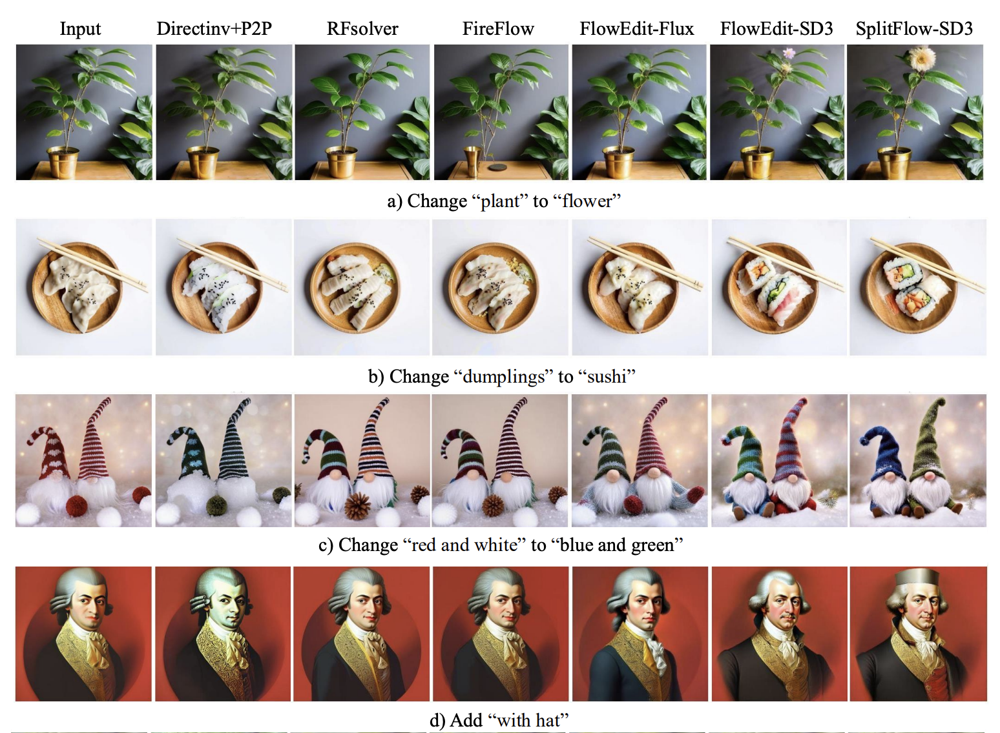
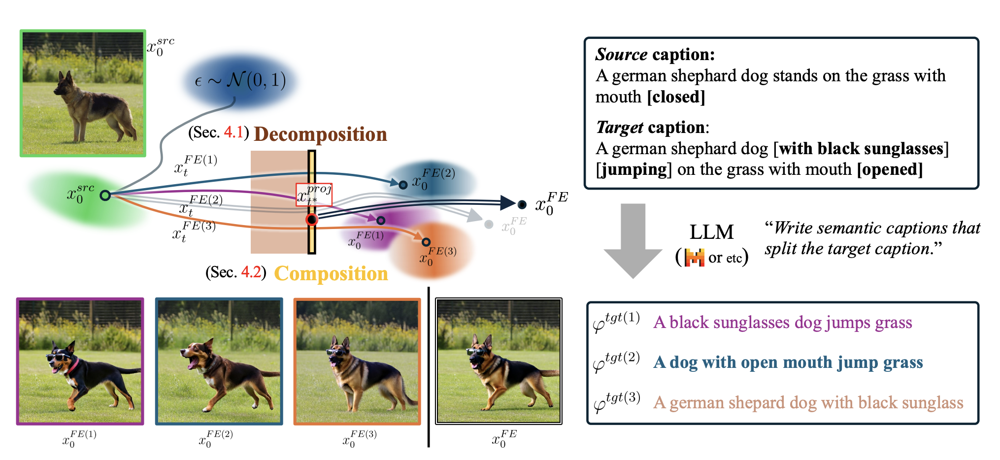

[](https://github.com/topics/text-guided-image-editing)
[](https://www.python.org/downloads/release/python-38/)


# SplitFlow (NeurIPS 2025)


### [SplitFlow: Flow Decomposition for Inversion-Free Text-to-Image Editing](https://www.arxiv.org/abs/2510.25970) 
([Sung-Hoon Yoon](https://scholar.google.com/citations?user=gnEghLkAAAAJ&hl=ko&oi=ao) *, Minghan Li *, Gaspard Beaudouin, Congcong Wen, Muhammad Rafay Azhar, Mengyu Wang)

<p align="center">
  
</p>

SplitFlow extends FlowEdit by leveraging LLMs to decompose editing prompt into progressive manner, enabling more natural image editing results even in complex scenarios.


## Installation

1. Clone the repository
```bash
git clone https://github.com/Harvard-AI-and-Robotics-Lab/SplitFlow
cd SplitFlow
```

2. Create conda environment and install dependencies
```bash
conda create -n splitflow python=3.8
conda activate splitflow
```

3. Install PyTorch (CUDA 12.1)
```bash
pip install torch==2.4.1 torchvision torchaudio --index-url https://download.pytorch.org/whl/cu121
```

4. Install required packages
```bash
pip install diffusers==0.30.1 transformers==4.46.3 accelerate==1.0.1 \
            sentencepiece==0.2.0 protobuf==5.29.3 matplotlib
```

5. LLM Model Setup
- The code automatically downloads `mistralai/Mistral-7B-Instruct-v0.3` model

## Running Examples

Run editing with Stable Diffusion 3:
```bash
python run_script.py --exp_yaml SD3_SplitFlow.yaml
```


## Usage - Your Own Examples

### 1. Prepare Input Images
Upload images you want to edit to the `example_images` folder.

### 2. Create Edit Dataset File
Create an `edits.yaml` file that specifies:
- `input_img`: Path to the input image
- `source_prompt`: Prompt describing the source image
- `target_prompts`: Prompt describing the target edit

Example:
```yaml
-
    input_img: example_images/your_image.jpg
    source_prompt: A group of sheep stands on a green meadow
    target_prompts:
    - Three dogs with sunglasses stands on a green meadow with snowy mountains
```

### 3. Create Experiment Configuration File
Create an experiment file following the format of `SD3_SplitFlow.yaml`:
- `exp_name`: Experiment name (output directory name)
- `dataset_yaml`: Path to the edit dataset file
- `model_type`: Model type to use (currently supports "SD3")
- `T_steps`: Number of sampling steps (default: 50)
- `n_min`, `n_max`: Timestep range where editing is applied (0~33 recommended)
- `src_guidance_scale`: Source guidance scale (default: 3.5)
- `tar_guidance_scale`: Target guidance scale (default: 13.5)
- `seed`: Random seed

For detailed discussion on hyperparameters, please refer to the [FlowEdit,ICCV 2025](https://arxiv.org/abs/2412.08629) paper.

### 4. Run
```bash
python run_script.py --exp_yaml <your_experiment.yaml>
```

### 5. Check Results
Edited images are saved at `outputs/<exp_name>/<model_type>/src_<source_name>/tar_<target_id>/`.
Each output folder contains:
- Edited image (PNG file)
- `prompts.txt`: Prompt and configuration information used

## Project Structure

```
SplitFlow/
├── run_script.py              # Main execution script
├── SplitFlow_utils.py         # SplitFlow algorithm implementation
├── SD3_SplitFlow.yaml         # SD3 experiment configuration file
├── edits.yaml                 # Edit dataset file
├── assets/                    # README images and resources
├── example_images/            # Input images folder
└── outputs/                   # Output results folder
```

## Algorithm Overview

<p align="center">
  
</p>

SplitFlow edits images through the following process:

1. **Prompt Decomposition**: Uses LLM to decompose complex target prompts into 3 intermediate steps
2. **Editing with Decomposed Flows**: Applies each intermediate prompt sequentially while performing flow matching
3. **Aggregation and Final Editing**: Applies the final target prompt to generate the final image

This approach divides complex editing tasks into multiple steps, enabling more natural and controllable editing results.

## Supported Models

Currently supports the following models:
- **Stable Diffusion 3** (SD3): `stabilityai/stable-diffusion-3-medium-diffusers`
- **LLM**: `mistralai/Mistral-7B-Instruct-v0.3`

## License
This project is licensed under the [MIT License](LICENSE).

## References

If you find our work useful, please consider citing our paper :)

```
@article{yoon2025splitflow,
  title={SplitFlow: Flow Decomposition for Inversion-Free Text-to-Image Editing},
  author={Yoon, Sung-Hoon and Li, Minghan and Beaudouin, Gaspard and Wen, Congcong and Azhar, Muhammad Rafay and Wang, Mengyu},
  journal={arXiv preprint arXiv:2510.25970},
  year={2025}
}
```

This project is based on FlowEdit (ICCV 2025), Huge thanks to authors!
